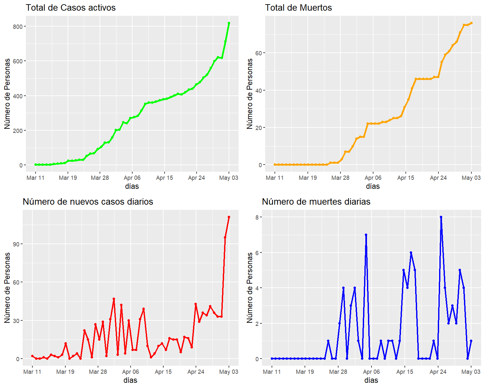

**Estimación del número de infectados de COVID19 en Honduras**
==============================================================

El coronavirus (covid19) en Honduras representa un serio problema para
el sistema de salud y económico del país. Honduras igual que otros
países ha implementado medidas no farmaceuticas como cuarentena a nivel
nacional, cierre de colegios, escuelas y universidades, prohibición de
reuniones y eventos públicos, entre otras. Pese que estas medidas
reducen el número de contagios evitando la saturación del sistema de
salud, han paralizado la economía del país perjudicando gravemente las
clases sociales media y baja. Además, la demanda de equipos médicos en
hospitales y equipo de protección básico para el público en general
aumenta, generando costos adicionales para el gobierno. Por lo tanto, es
necesario establecer un modelo que simule la dinámica de infección del
virus, y así realizar una adecuada planificación de recursos…

Los registros de casos y muertes publicados para los últimos siete días
se presentan en la siguiente tabla, a la fecha, el total muertes es
menor al total de recuperados. El número de nuevos casos registrados se
ha triplicado.

``` r
tail(data,7)
#>    no  dates new.cases daily.deaths active.cases total.deaths total.cases
#> 48 48 Apr 27        34            2          521           61         661
#> 49 49 Apr 28        41            3          559           64         702
#> 50 50 Apr 29        36            2          599           66         738
#> 51 51 Apr 30        33            5          621           71         771
#> 52 52 May 01        33            4          617           75         804
#> 53 53 May 02        95            0          712           75         899
#> 54 54 May 03       111            1          818           76        1010
#>    total.recovered
#> 48              79
#> 49              79
#> 50              73
#> 51              79
#> 52             112
#> 53             112
#> 54             116
```

En el gráfico superior izquierdo se presenta el total de casos activos a
la fecha que presenta un comportamiento exponencial creciente, el
gráfico superior derecho presenta el total de muertos a la fecha, pese
que su comportamiento es creciente, no se desarrolla de forma
exponencial. En los gráficos inferiores, se presentan el registro diaro
de nuevos casos (izquierdo), que en los ultimos días. el número de casos
tiene un crecimiento abrupto. Mientras que el número de muertes diarias
(gráfico derecho), no ha sido mayor a 8 casos.

``` r
g1 = gplot(dat = data,ts = data$new.cases,title = "Número de nuevos casos diarios")
g2 = gplot(dat = data,ts = data$daily.deaths,color = "blue",title = "Número de muertes diarias")
g3 = gplot(dat = data,ts = data$active.cases,color = "green",title = "Total de Casos activos",1.3)
g4 = gplot(dat = data,ts = data$total.deaths,color = "orange",title = "Total de Muertos",1.3)

gridExtra::grid.arrange(g3,g4,g1,g2,ncol = 2)
```


